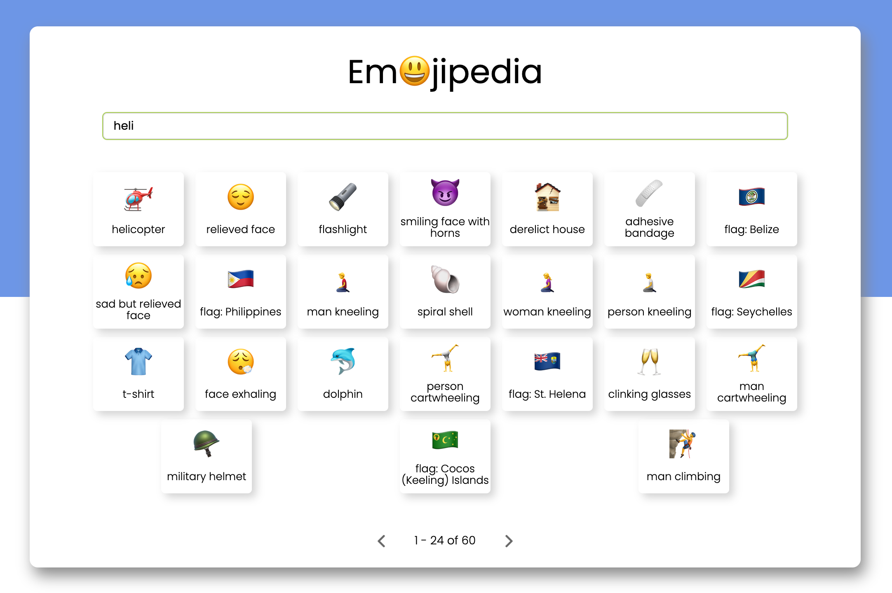

# Emojipedia

An emoji dictionary - search tool for emojis build in React.
Checkout the link in the repository details to view the application.

## About the project

The project uses the [fuzzy-search algorithm](https://fusejs.io/) to fetch results from the source. The source for the emojis can be found [here](https://raw.githubusercontent.com/github/gemoji/master/db/emoji.json)

### Snapshot of the application

